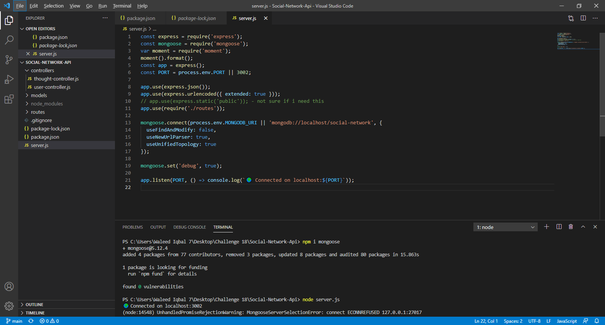

# social-network-api

AS A social media startup
I WANT an API for my social network that uses a NoSQL database
SO THAT my website can handle large amounts of unstructured data

# How to Run the Program
Install Express and Mongoose in your terminal followed by node server.js and application should connect on local host: 3002

Credit Source: @katguerin
